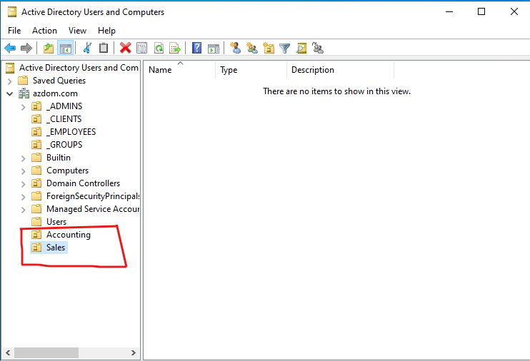
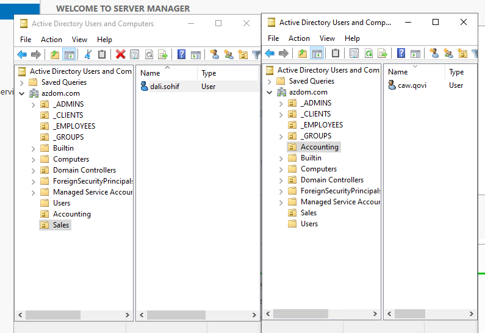
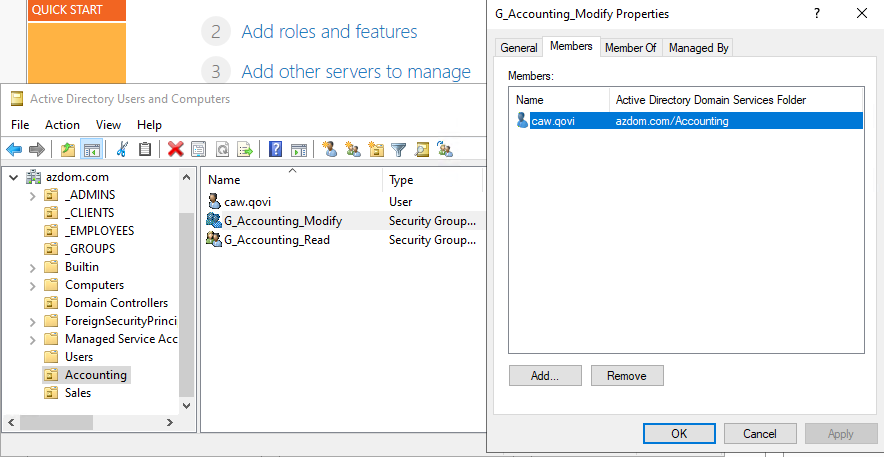
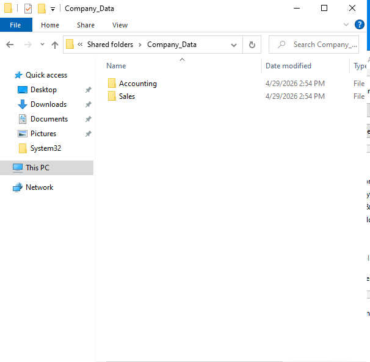
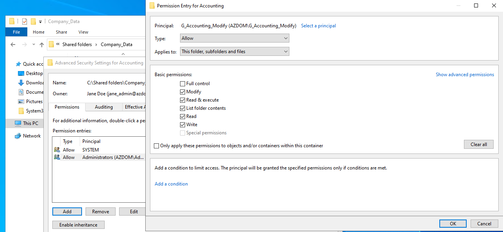
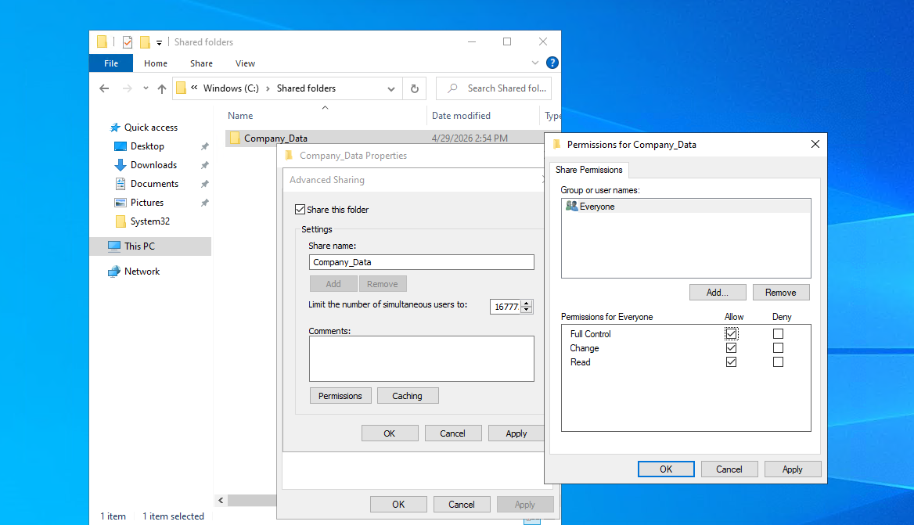
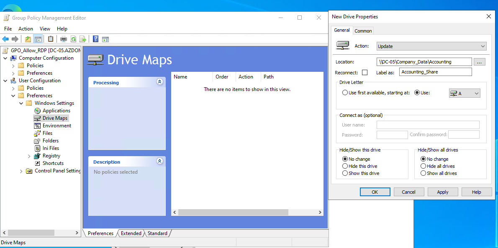
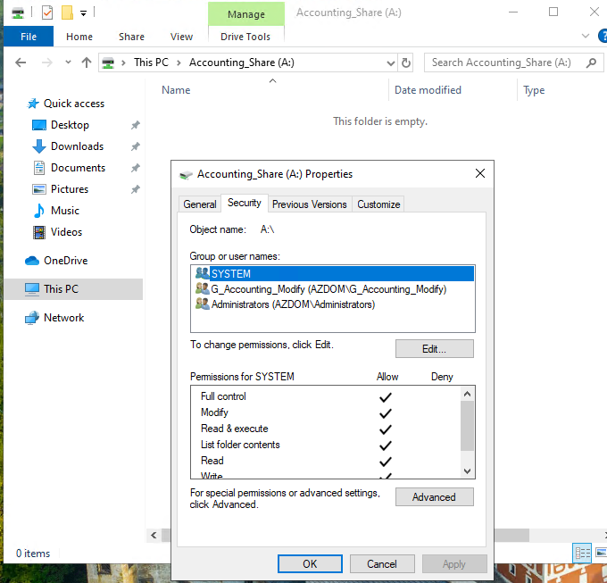
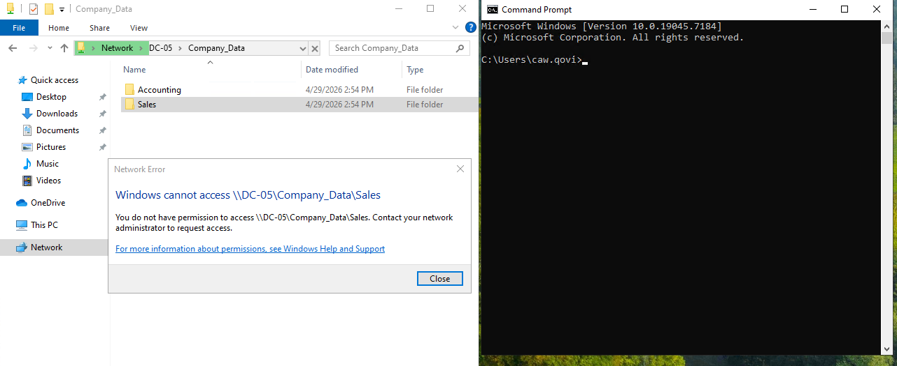

# Network File Sharing And Security Permissions 

## Project Summary
This project focuses on the deployment of a secure, centralized file-sharing environment within a Windows Server 2022 infrastructure. The primary goal was to enforce the **Principle of Least Privilege** through Role-Based Access Control (RBAC) and automate the delivery of these resources to end-users via Group Policy.

By integrating Active Directory (AD DS) with NTFS security protocols, I successfully engineered a scalable data management system where access is governed strictly by departmental security groups.

---

## Technical Stack
* **Operating Systems:** Windows Server 2022, Windows 10 Pro (Client)
* **Directory Services:** Active Directory (ADUC), GPMC
* **Security Standards:** NTFS Permissions, Share-level ACLs, Inheritance Blocking
* **Automation:** Group Policy Preferences (Drive Mapping)

---

## Implementation Workflow

### 1. Directory Services & RBAC Architecture
The domain was organized into departmental Organizational Units (OUs) to house specific user accounts. I implemented **Role-Based Access Control (RBAC)** by creating Global Security Groups (e.g., `G_Accounting_Modify`). Users were then assigned to these groups based on their job function, ensuring centralized management of permissions.

### 2. File Infrastructure & Security Lockdown
I provisioned a root directory (`Company_Data`) with dedicated sub-folders for each department. To ensure a granular security posture, I **disabled permission inheritance** on departmental folders. This allowed for the removal of broad default access (e.g., "Domain Users") and the implementation of explicit permissions for the authorized Global Groups only.

* **Security Logic:** Share-level permissions were set to "Full Control" for "Everyone" to allow the restrictive NTFS ACLs to act as the primary security authority.

---

## Operations & Verification

### Automated Resource Delivery (GPO)
To streamline the end-user workflow, I engineered a **Group Policy Object (GPO)** targeting the departmental OUs. Using Group Policy Preferences, I configured automatic drive mapping to connect the departmental share as a persistent network drive upon user logon.

### Validation & Stress Testing
Testing was executed from a domain-joined workstation using the account `caw.qovi`:
* **Drive Mapping Success:** The departmental share was mapped automatically and verified for full modify/delete capabilities within the designated folder.
* **Security Enforcement:** A manual attempt to bypass security and access the unauthorized **Sales** directory resulted in an immediate **"Access Denied"** system error, validating the integrity of the NTFS lockdown.

---

## Key Performance Indicators (KPIs)
* **Security Integrity:** Zero unauthorized access to restricted departmental data.
* **Operational Efficiency:** Automated drive provisioning reduced manual help desk requests for resource access.
* **Scalability:** The RBAC model allows for the addition of new users without modifying folder ACLs.

---
**Developed by [Taki] | Systems Infrastructure & IT Operations Portfolio.**
